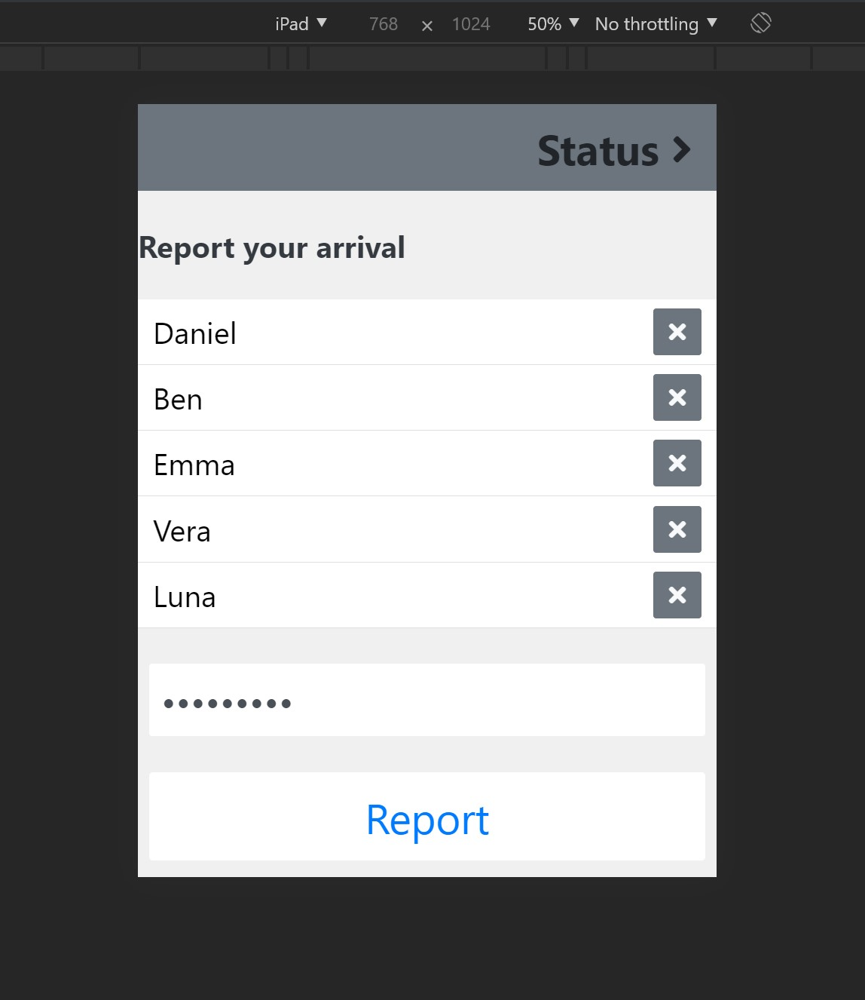

# Report App

This proof-of-concept app is meant for door opening as you sign in with password your're status should be registered as arrived. 


## Installation

Ruby on rails installed on your machine and sqlite


```
1. cd rails-api
```

Make sure to create the database with tables and columns with the following command

```
2. Run rails db:migrate
```

The last step is to seed some data into database so that frontend can query it

```
3. Run rails db:seed
```

###If you don't have ruby installed on your machine I prepared a mock node server for you.

```
1. cd node-server
```

Make sure to install all dependencies

```
2. Run npm install
```

Then start the node server 

```
3. npm start
```

## Usage example

This app should viewed with having the **developer tools** open and make sure that you have the **toggle device toolbar** open and set it to ipad. This app was build around ipad for the best experience recommend setting to ipad 


## Development setup

For setting up the frontend application 

```
1. cd vue-app
```

Make sure to install all dependencies

```
2. Run npm install
```

Then start **vue.js**

```
3. npm run serve
```
